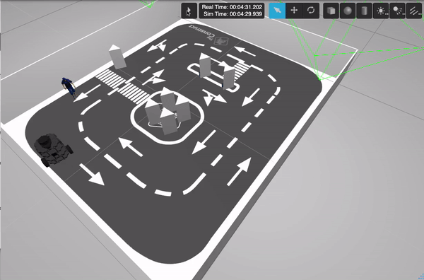
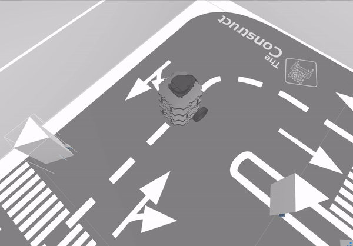

# Robot following the wall Project 

This project is part of the final assessment of the ROS Basics (Python) at [The Construct Academy](https://www.theconstructsim.com/)

## Requirements 
### ROS Environment 

- ROS Noetic

### Robotic Platform 

- TurtleBot3

### Description 
The wall-following behaviour makes the robot **follow along the wall on its right-hand side**. It is composed of three sections:

#### Section 1: Follow the Wall

- Subscribe to the *laser topic* of the robot. ```/scan``` 
- Publish to the *velocity topic* of the robot ```/cmd_vel```



#### Section 2: Service Server to find the closest wall

- The service server uses a ```FindWall``` message that returns ```True```when the wall is found and the robot is ready to follow it. 



#### Section 3: Action 
The goal of this section is to create an action server that records the robot's odometry or trajectory of the robot. 

- The action server uses an ```OdomRecord.action``` message that returns the list of odometries recorded and the feedback is the distance travelled by the robot at the moment. 

Check the program working in real life [here.](https://www.youtube.com/watch?v=-ZXuvrhpG-s)
